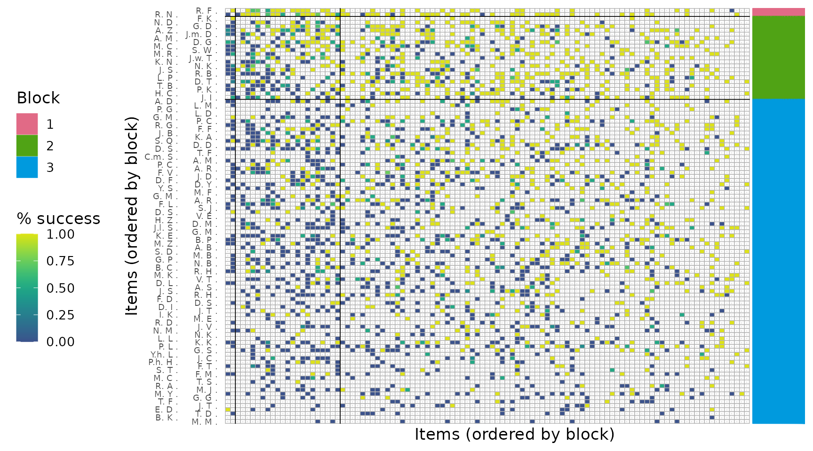
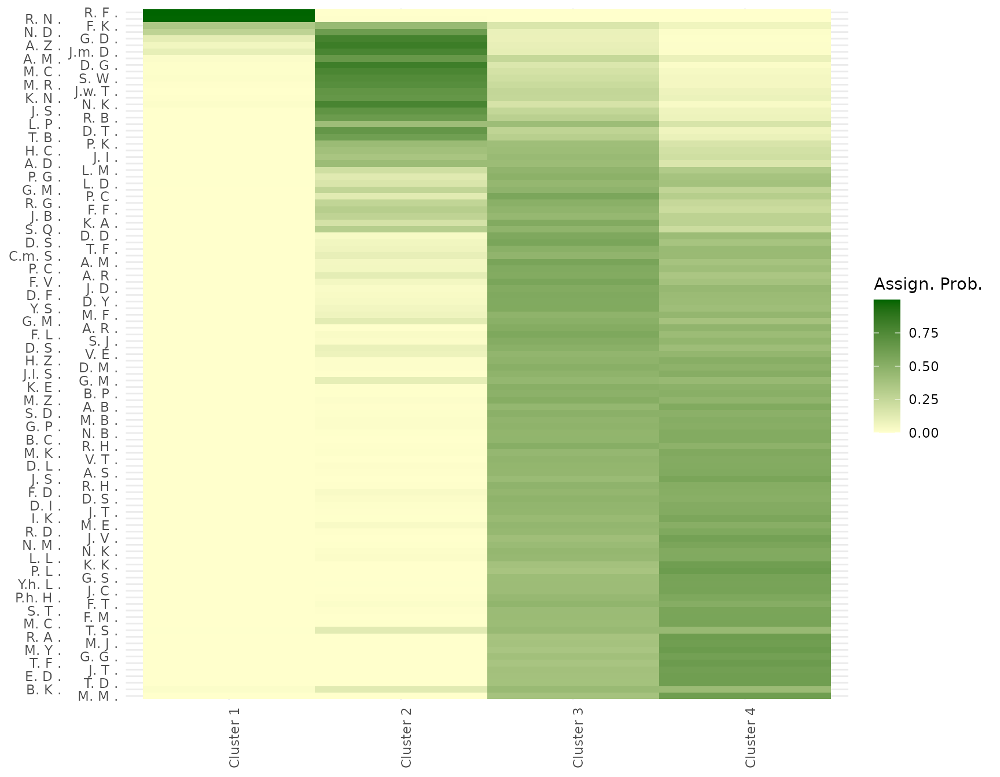
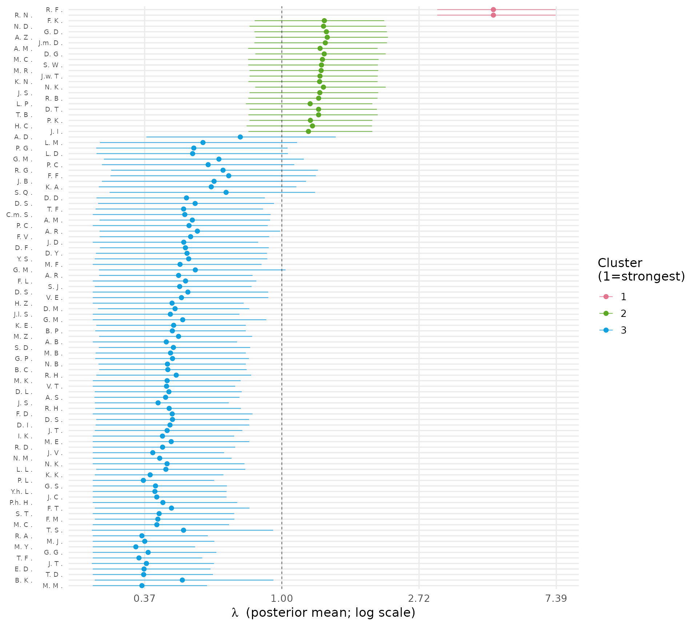
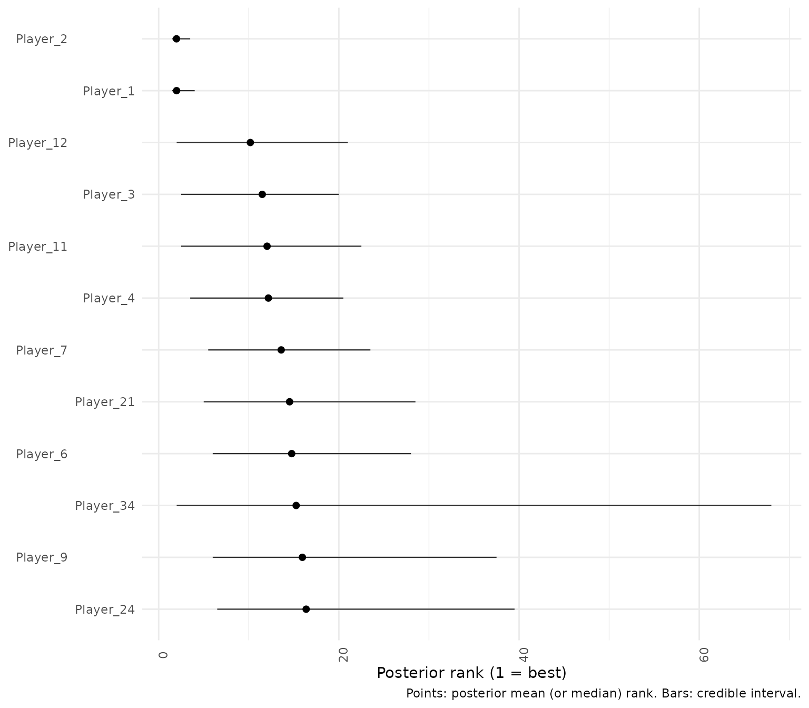

# Getting started with BTSBM: the R package for the BT-SBM paper

## Overview

This vignette shows a minimal workflow with the `BTSBM` functions. We
use as illustrative dataset the 2017 Men’s ATP season for convenience.

### Set up the data

``` r

#choosing the 2017 season
w_ij = ATP_2000_2025$`2017`$Y_ij

#quick look at the matrix
head(w_ij[1:3,1:3])
```

    #>             Nadal R. Federer R. Dimitrov G.
    #> Nadal R.           0          0           3
    #> Federer R.         4          0           1
    #> Dimitrov G.        0          0           0

Each entry (`w_{ij}`) counts how many matches player (`i`) won against
(`j`) in the chosen season. The matrix is directed (wins aren’t
symmetric), and the diagonal is zero by design. In practice, sparse
rows/columns correspond to players with few matches.

### Prior elicitation

``` r

# Gamma hyper.
a_strength = 2 # robust choice
```

Choosing a prior on (\\K\\). The number of clusters is unknown. on (K)
to let the data negotiate between parsimony (few blocks) and
expressiveness (many blocks). This also curbs the classic tendency of
mixture-like models to over-split when data are noisy.

``` r

#Gnedin model chosen (Other possible choices "DM", "PY", "DP")
prior = 'GN'
gamma_GN = 0.8
n = nrow(w_ij)
#check E[K | gamma, n]
round(gnedin_K_mean(n,gamma_GN))
```

    #> [1] 2

``` r

#check Var[K | gamma, n]
gnedin_K_var(n,gamma_GN)
```

    #> [1] 45.95132

### Run the MCMC

We now draw samples from the joint posterior distribution using a
collapsed Gibbs sampler. In this simplified demonstration the chain
length is intentionally short; in empirical applications, longer runs or
parallel chains are recommended.

``` r

set.seed(123)
T_iter = 10000 #for real use set it to 30,000
T_burn = 2000

out <- BTSBM::gibbs_bt_sbm(
  w_ij   = w_ij,
  a = a_strength,
  prior  = prior,       # "DP", "PY", "DM", or "GN"
  gamma_GN =  gamma_GN,
  T_iter = T_iter, 
  T_burn = T_burn,
  verbose = T
)
```

    #> iter 1000 occupied = 4 
    #> iter 2000 occupied = 7 
    #> iter 3000 occupied = 7 
    #> iter 4000 occupied = 5 
    #> iter 5000 occupied = 4 
    #> iter 6000 occupied = 5 
    #> iter 7000 occupied = 4 
    #> iter 8000 occupied = 7 
    #> iter 9000 occupied = 7 
    #> iter 10000 occupied = 3

### Relabel and summarize

The posterior distribution of latent block-assignments is invariant
under permutations of cluster labels. Consequently, averaging or
summarizing raw samples is meaningless without post-processing.
Relabeling methods align label permutations across iterations, enabling
consistent summaries of cluster-specific parameters.

``` r

library(dplyr)
library(ggplot2)
library(kableExtra)
post <- BTSBM::relabel_by_lambda(out$x_samples, out$lambda_samples)

# Pretty table of the K posterior distribution
pretty_table_K_distribution(post)
```

|     3 |     4 |    5 |     6 |     7 |
|------:|------:|-----:|------:|------:|
| 0.152 | 0.302 | 0.25 | 0.164 | 0.076 |

### Obtain point estimates

Partition estimates such as the Binder or Minimum Variation of
Information (MinVI) losses are the state-of-the-art point estimate
methods for partition samples. Binder’s loss tends to favor slightly
finer partitions, while MinVI is more conservative. Comparing these
estimates provides insight into the stability of the inferred grouping
structure.

``` r

x_binder <- post$partition_binder #partition with Binder loss
table(x_binder) #Block sizes
```

    #> x_binder
    #>  1  2  3  4  5  6  7  8  9 10 11 
    #>  2  1 16  5  1  1  1  1  3  1 73

``` r

x_minVI <- post$minVI_partition #partition with MIN-VI loss
table(x_minVI) #Block sizes
```

    #> x_minVI
    #>  1  2  3 
    #>  2 21 82

### Plot reordered adjacency matrix

The reordered adjacency matrix reveals the empirical interaction pattern
between inferred blocks. Dark-green colour in the right off-diagonal
region correspond to high winning proportions, while uniform colours
along the main diagonal indicate balanced competitiveness within
clusters. This visualization serves as a qualitative validation of the
inferred block structure.

``` r

plot_block_adjacency(fit = post,
                     w_ij = w_ij,
                     bw_preview = FALSE)
```



### Plot assignment uncertainty

Posterior probabilities of assignment \\p(x_i = k \| W)\\ quantify the
uncertainty of player-to-block allocations. High uncertainty for certain
individuals typically signals boundary cases or transitional players
whose performance profile lies between different clusters.

``` r

plot_assignment_probabilities(fit = post, w_ij = w_ij, x_hat = post$minVI_partition)
```



### Plot lambda uncertainty

Posterior uncertainty in \\\lambda\_{x_i}\\, the strength of player i.
Since all players assigned to the same block share the same \\\lambda\\,
the uncertainty here is driven by the assignment uncertainty. Reporting
credible intervals gives a precise idea of the relative strength
differences between clusters, and between players as well.

``` r

plot_lambda_uncertainty(
  fit = post,
  w_ij = w_ij,
  clean_fun = clean_players_names,
  x_hat = post$minVI_partition
)
```



### Summarise block-level win probabilities

The relabelled posterior draws can also be collapsed into a
block-by-block table of Bradley-Terry win probabilities. Weighting by
the observed match counts makes the summary emphasise the block pairs
that were actually well observed in the data.

``` r

block_tbl <- block_winprob_table_from_lambdas(
  lambda_item = post$lambda_samples_relabel,
  z = post$minVI_partition,
  N_ij = w_ij + t(w_ij)
)

knitr::kable(round(block_tbl$P_block, 3), caption = "Estimated block win probabilities")
```

|         | Block_1 | Block_2 | Block_3 |
|:--------|--------:|--------:|--------:|
| Block_1 |      NA |   0.780 |   0.896 |
| Block_2 |   0.220 |      NA |   0.709 |
| Block_3 |   0.104 |   0.291 |      NA |

Estimated block win probabilities {.table}

### Plot posterior rank intervals

Ranking summaries are computed directly from the relabelled
player-strength draws. These intervals complement the lambda plot by
showing posterior uncertainty on the rank scale, where 1 is the
strongest player.

``` r

plot_rank_intervals(post, max_players = 12)
```


