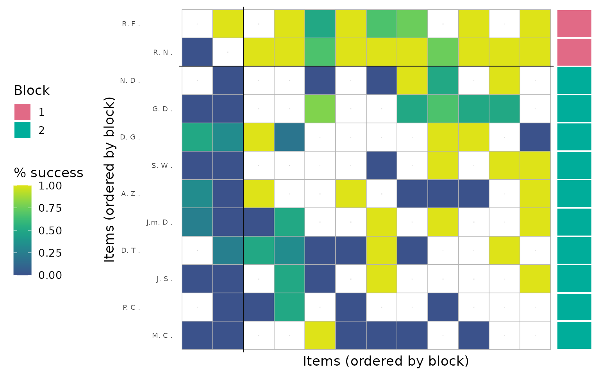
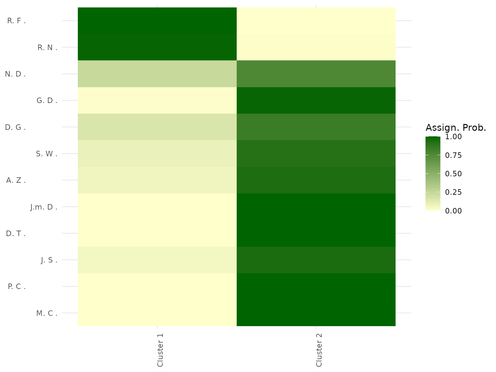

# Getting Started with BTSBM

This vignette shows a lightweight workflow for fitting a Bradley-Terry
stochastic block model and producing core summaries.

``` r

library(BTSBM)
```

## Data

``` r

w_ij <- ATP_2000_2025$`2017`$Y_ij[1:12, 1:12]
diag(w_ij) <- 0L
w_ij[1:3, 1:3]
#>             Nadal R. Federer R. Dimitrov G.
#> Nadal R.           0          0           3
#> Federer R.         4          0           1
#> Dimitrov G.        0          0           0
```

## Fit

``` r

fit <- gibbs_bt_sbm(
  w_ij = w_ij,
  a = 2,
  prior = "GN",
  gamma_GN = 0.8,
  T_iter = 200,
  T_burn = 100,
  verbose = FALSE
)
```

## Relabel and Summarise

``` r

post <- relabel_by_lambda(fit$x_samples, fit$lambda_samples)
pretty_table_K_distribution(post)
```

|    2 |    3 |
|-----:|-----:|
| 0.62 | 0.32 |

## Core Plots

``` r

plot_block_adjacency(fit = post, w_ij = w_ij)
```



``` r

plot_assignment_probabilities(fit = post, w_ij = w_ij, x_hat = post$minVI_partition)
```



``` r

plot_lambda_uncertainty(fit = post, w_ij = w_ij, x_hat = post$minVI_partition)
```


``` r

plot_rank_intervals(post, max_players = 12)
```


