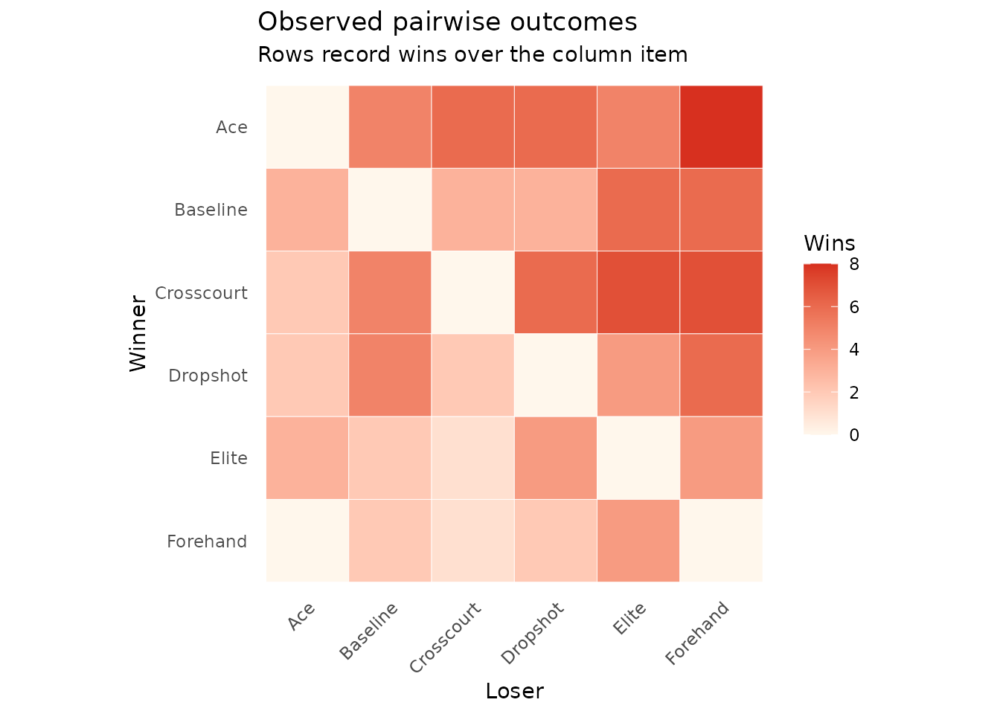
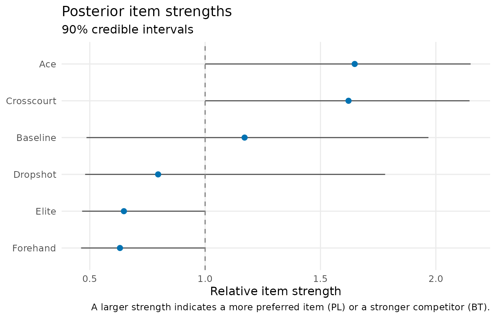
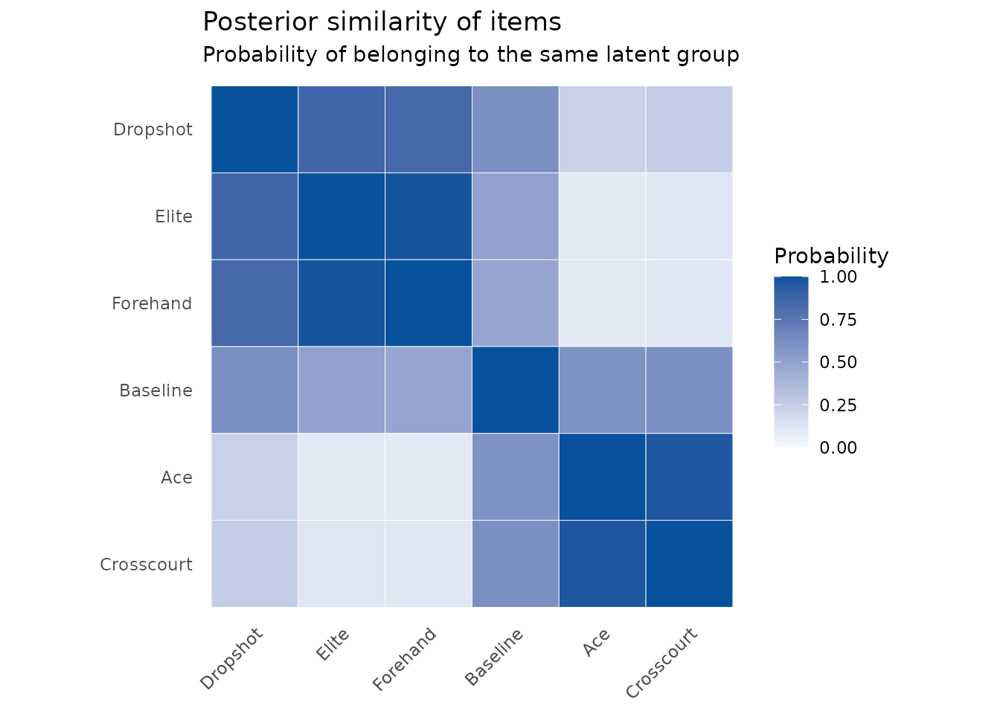
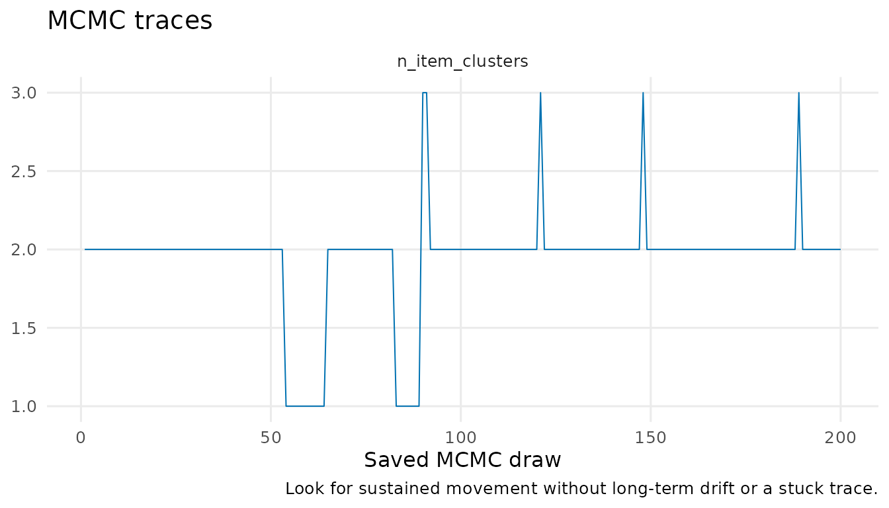

# Getting started: from results to a Bradley--Terry analysis

## What this package does

BTSBM analyses two kinds of preference data:

1.  Pairwise results: one item wins or loses against another, such as a
    match in a league.
2.  Rankings: a person places several items from most to least
    preferred.

This first tutorial uses pairwise results. The ranking tutorial is
vignette(“pl-ranking-models”).

A Bradley–Terry (BT) model assigns every player a positive strength. A
larger strength means a greater probability of winning against a player
with a smaller strength. A BT–SBM additionally lets the data group
players with similar strengths into latent tiers.

``` r

library(BTSBM)
```

## 1. Start with data you can inspect

The toy tennis league is synthetic and intentionally small. wins\[i, j\]
means the number of times player i beat player j. The diagonal is zero
because a player does not play themself.

``` r

tennis <- tennis_toy(matches_per_pair = 8, seed = 1)
tennis$wins
#>            Ace Baseline Crosscourt Dropshot Elite Forehand
#> Ace          0        5          6        6     5        8
#> Baseline     3        0          3        3     6        6
#> Crosscourt   2        5          0        6     7        7
#> Dropshot     2        5          2        0     4        6
#> Elite        3        2          1        4     0        4
#> Forehand     0        2          1        2     4        0
```

Before fitting a model, inspect the observed outcomes. Darker cells
identify frequent wins by the row player over the column player.

``` r

plot_pairwise_outcomes(tennis)
```



This plot is descriptive: it does not yet account for uncertainty or
combine all opponents into one estimate of player strength.

## 2. Choose a model

Start with a BT–SBM when you think players may form broad tiers rather
than a completely reliable order from first to last. Here, the Gnedin
prior lets the number of tiers be learned from the data.

``` r

model <- bt_sbm_model(
  latent_strength = latent_strength(shape = 4, rate = exp(digamma(4))),
  item_clustering = gnedin_prior(gnedin_hyperparameter = 0.5)
)
model
#> <btsbm_model> Bradley--Terry with latent item clustering 
#>   latent strength: Gamma(shape = 4 , rate = 3.511761 )
#>   item clustering:<clustering_prior> Gnedin(gnedin_hyperparameter = 0.5)
```

The latent_strength() prior must be positive. item_clustering is a prior
over possible player tiers. You can use finite_partition(max_clusters =
3) when a strict upper limit is scientifically justified.

## 3. Fit the model

An MCMC fit produces many plausible values rather than one single
answer. warmup draws are discarded; the remaining draws represent
posterior uncertainty. The short chain below is suitable for a tutorial.
Use longer, multiple chains in a real study.

``` r

fit <- fit_btsbm(
  tennis,
  model,
  mcmc_control(iter = 400, warmup = 200, seed = 2)
)
fit
#> <btsbm_fit> bt / item_sbm with 200 saved draws
```

## 4. Read the main result: strengths and uncertainty

The point is the posterior mean strength. The horizontal line is a 90%
credible interval: it describes the remaining uncertainty after seeing
the results. Intervals that overlap substantially should not be read as
a certain ordering.

``` r

plot_strength_summary(fit)
```



The same information is available as a table, which is useful for
reporting.

``` r

strength_summary(fit)
#>         item      mean    median     lower    upper
#> 1        Ace 1.6482758 1.6820440 1.0000000 2.150828
#> 3 Crosscourt 1.6215289 1.6737805 1.0000000 2.146159
#> 2   Baseline 1.1710874 1.2384788 0.4858528 1.967910
#> 4   Dropshot 0.7962691 0.6177404 0.4798787 1.780272
#> 5      Elite 0.6479440 0.5967778 0.4668456 1.000000
#> 6   Forehand 0.6309056 0.5936463 0.4623794 1.000000
```

## 5. Ask whether the data support tiers

The model’s cluster labels can switch their names from one MCMC draw to
the next. Instead, use a posterior similarity plot. A dark cell means
the two players were frequently placed in the same tier.

``` r

plot_posterior_similarity(fit, target = "item")
```



## 6. Check the sampler before interpreting it

MCMC draws should move around a stable region. Trace plots are a quick
screening tool: long trends or a completely stuck trace are reasons to
run longer chains or reconsider the model.

``` r

plot_mcmc_traces(fit)
```



``` r

mcmc_diagnostics(fit)
#>          quantity  mean       sd      ess       mcse autocorrelation_lag_1
#> 1 n_item_clusters 1.935 0.333664 33.87867 0.05732528             0.6839837
```

## Where to go next

- Use bt_model() if every item should have its own strength without
  tiers.
- Use vignette(“pl-ranking-models”) when the observations are full or
  top-m rankings rather than wins and losses.
- Use vignette(“toy-data-gallery”) for additional worked synthetic
  examples.
