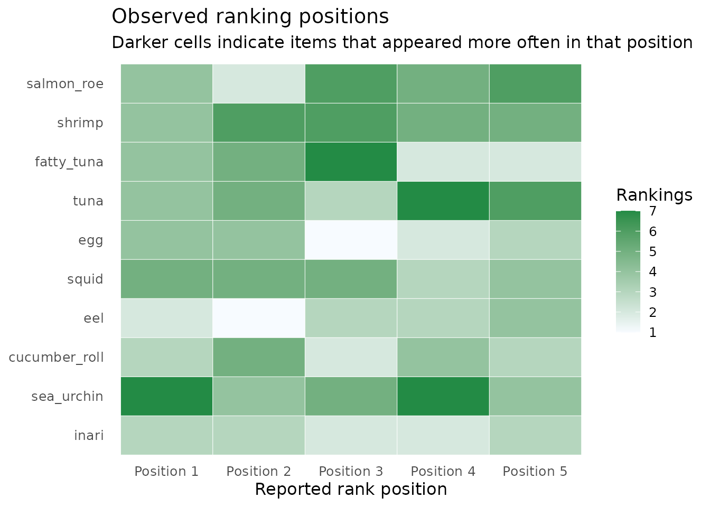
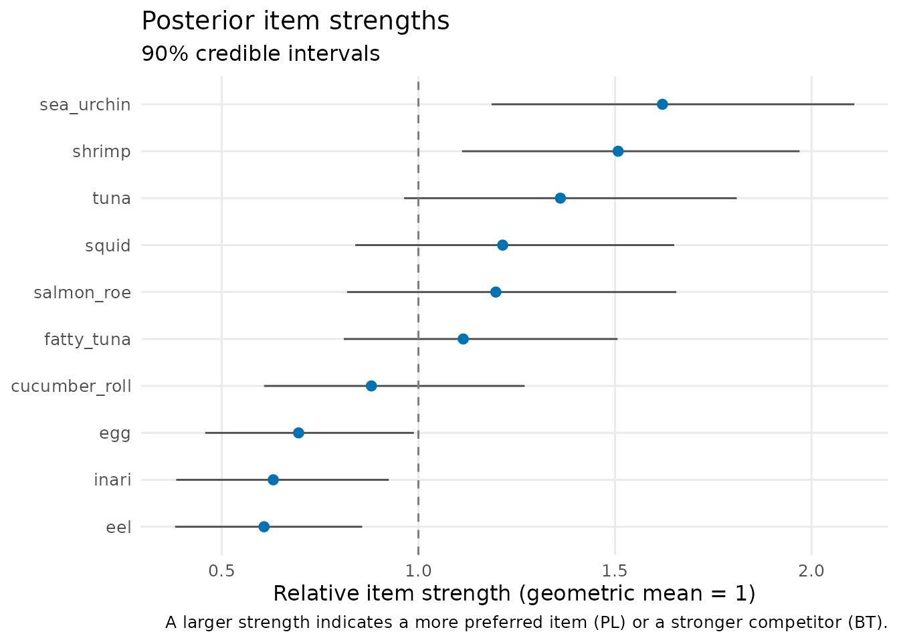
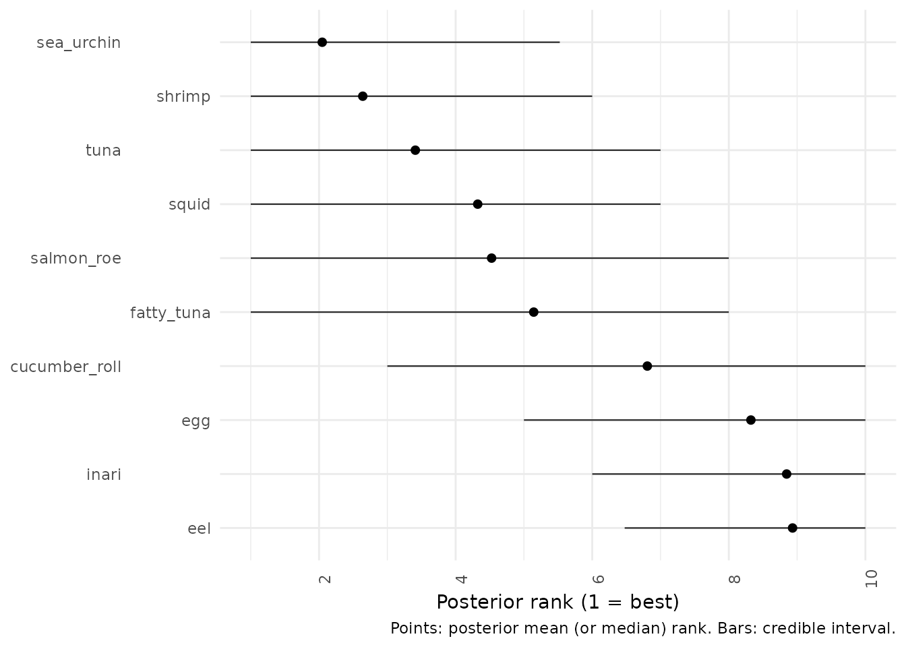
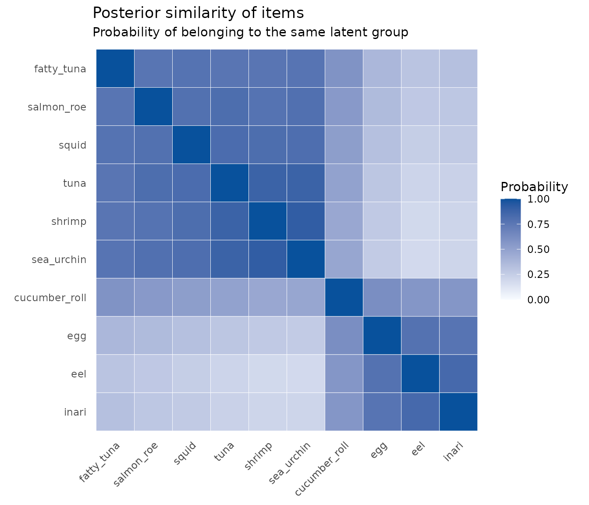
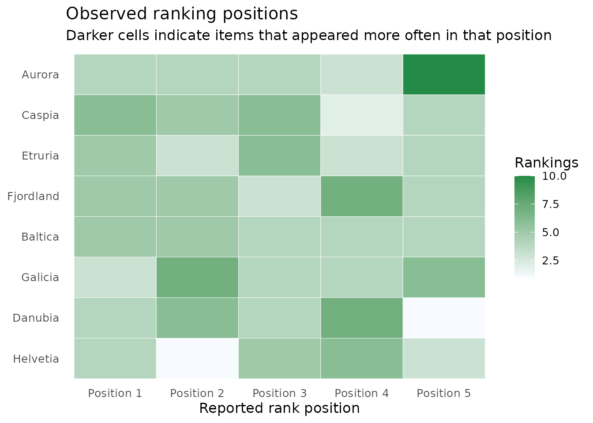
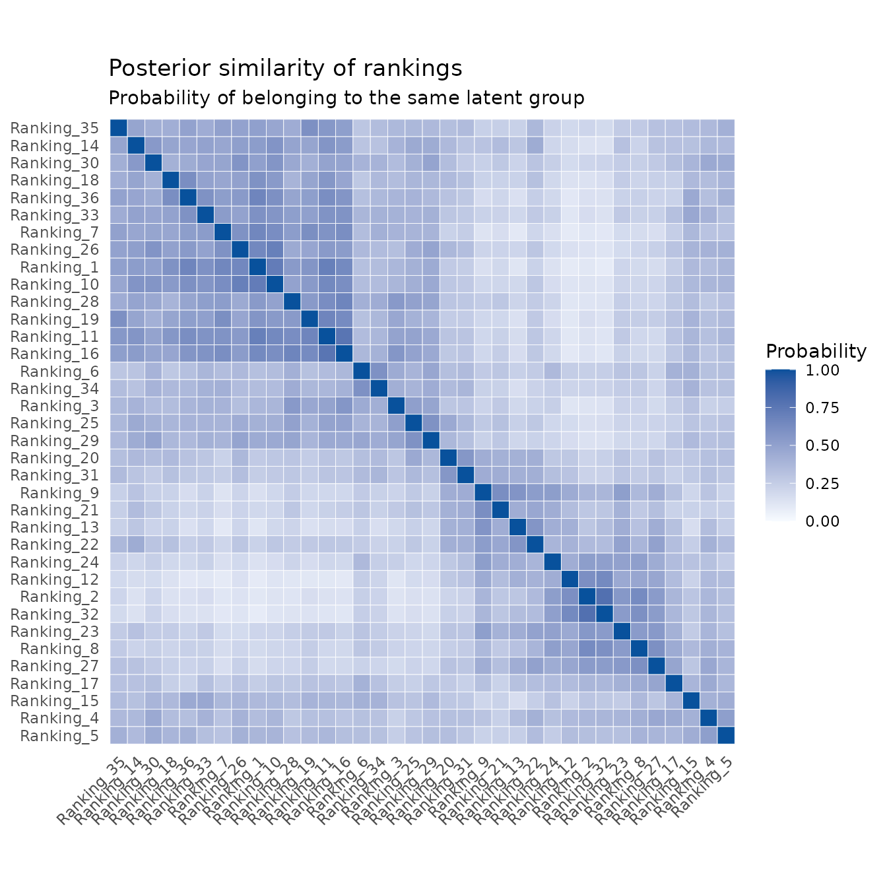
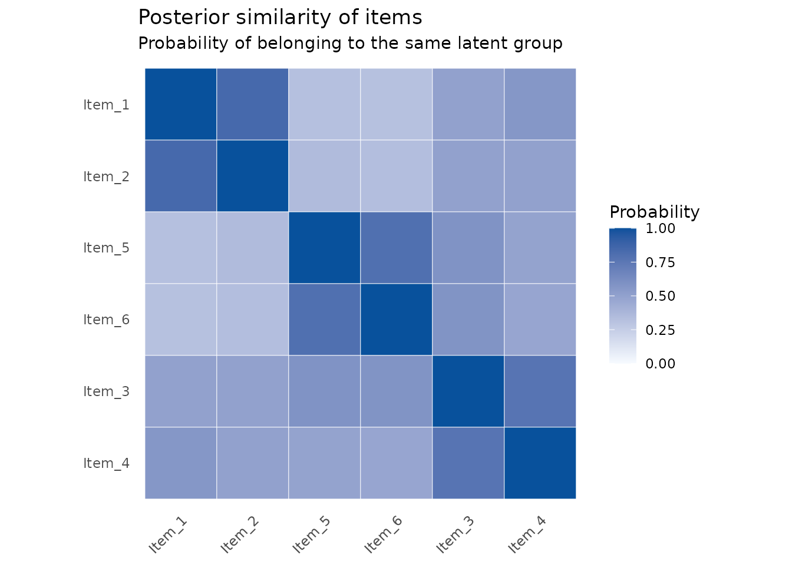
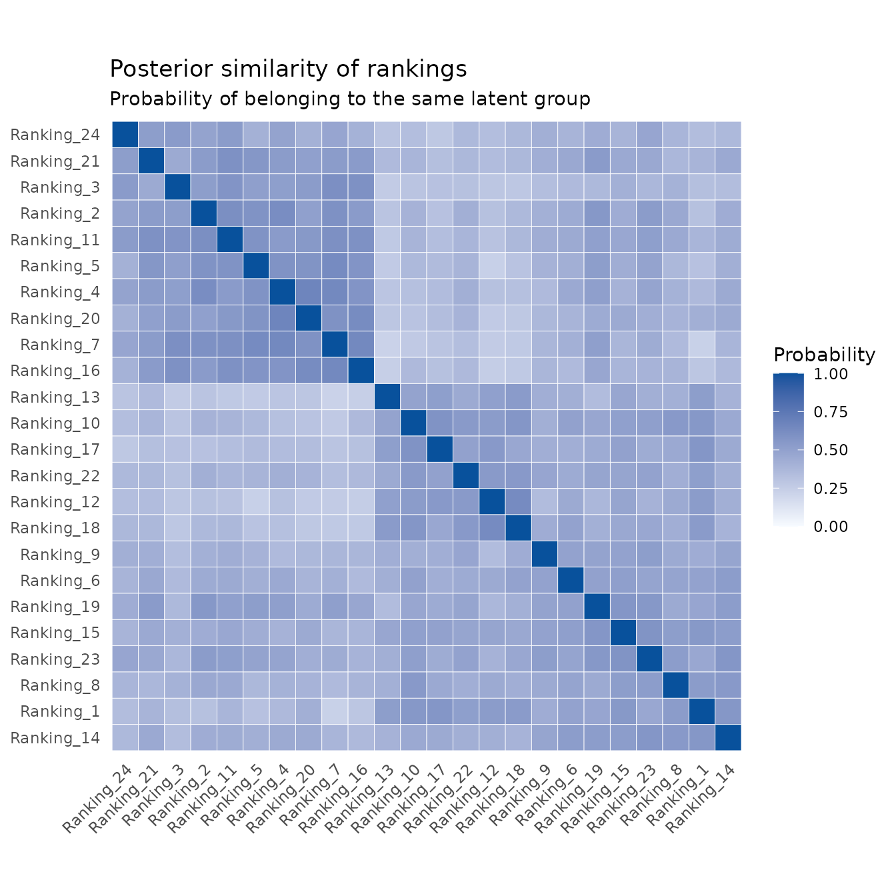
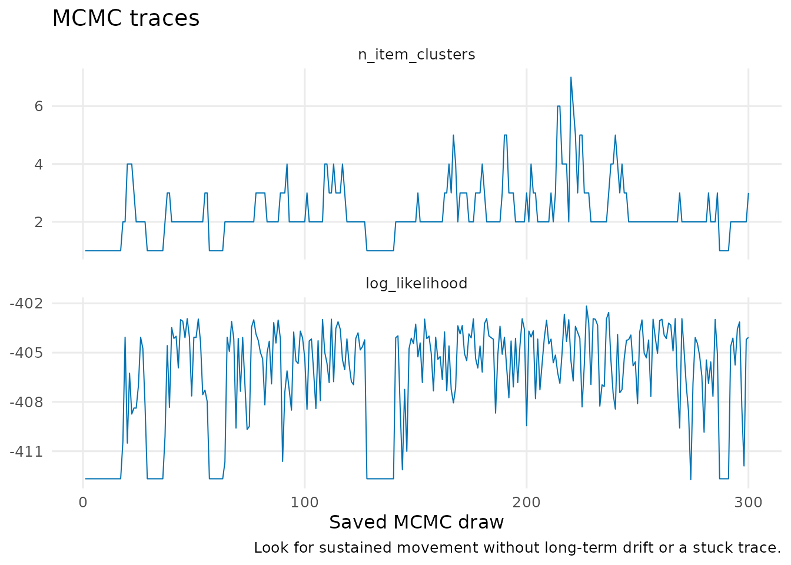

# Ranking data: a beginner's guide to Plackett--Luce models

## When should I use a ranking model?

Use a Plackett–Luce (PL) model when each observation is an ordered list,
such as sushi A was first, sushi B was second, and sushi C was third.
This is different from pairwise data, where an observation only says who
won one head-to-head comparison.

The model gives every item a positive relative strength. At each
position in a ranking, items with larger strengths are more likely to be
selected. The strengths are relative rather than absolute: multiplying
every strength by the same number would not change the predicted
rankings.

``` r

library(BTSBM)
```

## 1. Examine rankings before fitting

The original Sushi Preference Dataset is a well-known benchmark. Its
licence does not allow redistribution, so BTSBM includes a small
synthetic Sushi-inspired teaching dataset instead. You can obtain the
original data from [Kamishima’s data
page](https://www.kamishima.net/soft/) if its terms suit your use.

``` r

sushi <- sushi_toy(n_rankings = 40, rank_length = 5, seed = 2026)
sushi
#> <btsbm_ranking_data> 40 rankings of length 5 from 10 items
sushi$rankings[1:4, ]
#>           Rank_1 Rank_2 Rank_3 Rank_4 Rank_5
#> Ranking_1      9      1      5      2      3
#> Ranking_2      4      2      6     10      1
#> Ranking_3      7      5      8      3      6
#> Ranking_4     10      7      3      2      5
```

Each row is one respondent and each column is a reported position. The
next plot is a useful first look. It counts how often an item appears in
each position; it is not yet a fitted model.

``` r

plot_ranking_positions(sushi)
```



## 2. Fit a simple PL model

Start with the simplest model: one strength for each sushi type. The
Gamma prior keeps strengths positive. The short chain below is for
illustration; use longer, multiple chains in a real analysis.

``` r

simple_pl <- fit_btsbm(
  sushi,
  pl_model(latent_strength = latent_strength(shape = 1, rate = 1)),
  mcmc_control(iter = 600, warmup = 300, seed = 1)
)
simple_pl
#> <btsbm_fit> pl / none with 300 saved draws
```

This plot is usually the main analysis result. The point is the
posterior mean relative strength; the interval displays posterior
uncertainty.

``` r

plot_strength_summary(simple_pl)
```



Rank intervals translate those strengths into an easier question: what
place could each sushi item plausibly occupy? Rank 1 is best.

``` r

plot_rank_intervals(simple_pl)
```



## 3. Do some sushi types form a tier?

A PL–SBM lets items share a latent strength. It is useful when the data
support broad groups, such as often favoured and rarely favoured, but do
not support a precise order inside every group.

``` r

tiered_pl <- fit_btsbm(
  sushi,
  pl_sbm_model(
    item_clustering = gnedin_prior(gnedin_hyperparameter = 0.5)
  ),
  mcmc_control(iter = 600, warmup = 300, seed = 2)
)
```

Do not read raw MCMC cluster labels: label 1 in one draw need not mean
the same thing as label 1 in another draw. Instead, interpret the
posterior similarity plot. A dark cell means the two sushi types were
often placed in the same tier.

``` r

plot_posterior_similarity(tiered_pl, target = "item")
```



You can choose other priors for the item grouping. The names describe
the decision being made:

``` r

dirichlet_process_prior(concentration = 1)
pitman_yor_prior(concentration = 1, discount = 0.2)
finite_partition(max_clusters = 4, concentration = 1)
```

## 4. Could respondents have different preference profiles?

A PL mixture groups rankings, not sushi items. It answers questions such
as whether there are distinct kinds of respondent preference. The
Eurovision-inspired toy data is especially useful here because it has
simulated jury and viewer profiles.

``` r

votes <- eurovision_toy(n_rankings = 36, rank_length = 5, seed = 3)
plot_ranking_positions(votes)
```



``` r

mixture_fit <- fit_btsbm(
  votes,
  pl_mixture_model(
    ranking_clustering = dirichlet_process_prior(concentration = 1)
  ),
  mcmc_control(iter = 400, warmup = 200, seed = 4)
)
```

The rows and columns now refer to rankings, not acts. Dark blocks
suggest respondents whose preferences were often assigned together.

``` r

plot_posterior_similarity(mixture_fit, target = "ranking")
```



## 5. Jointly group respondents and items

The PL–LBM has both kinds of grouping: it clusters ranking rows and
items at the same time. It is useful for a question like which
respondent profiles prefer which groups of items. pl_lbm_toy() has known
simulated structure so you can see the workflow.

``` r

structured_rankings <- pl_lbm_toy(n_rankings = 24, rank_length = 4, seed = 5)
lbm_fit <- fit_btsbm(
  structured_rankings,
  pl_lbm_model(
    ranking_clustering = finite_partition(max_clusters = 3),
    item_clustering = finite_partition(max_clusters = 3)
  ),
  mcmc_control(iter = 400, warmup = 200, seed = 6)
)
```

``` r

plot_posterior_similarity(lbm_fit, target = "item")
```



``` r

plot_posterior_similarity(lbm_fit, target = "ranking")
```



## 6. Check the MCMC run

The diagnostics table and traces should be checked before interpreting a
partition. They are not a substitute for multiple chains, but they make
it easy to spot a trace that is stuck or still drifting.

``` r

mcmc_diagnostics(tiered_pl)
#>          quantity        mean        sd      ess      mcse
#> 1 n_item_clusters    2.263333 0.9919351 23.00151 0.2068260
#> 2  log_likelihood -406.622999 3.3293552 24.45201 0.6732911
#>   autocorrelation_lag_1
#> 1             0.7339248
#> 2             0.6772591
plot_mcmc_traces(tiered_pl)
```



For model comparison, log_lik() returns one likelihood contribution per
ranking. If the optional loo package is installed, use loo_btsbm() to
perform ranking-level PSIS-LOO.

## References

- Caron, F. and Doucet, A. (2012). Efficient Bayesian inference for
  generalized Bradley–Terry models. *Journal of Computational and
  Graphical Statistics*, 21(1), 174–196.
  <https://doi.org/10.1080/10618600.2012.638220>
- Kamishima, T. (2003). Nantonac collaborative filtering: Recommendation
  based on order responses. *Proceedings of the Ninth ACM SIGKDD
  International Conference on Knowledge Discovery and Data Mining*.
