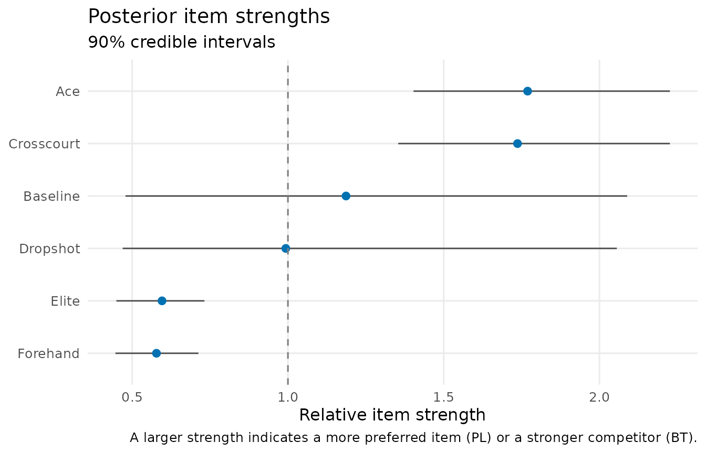
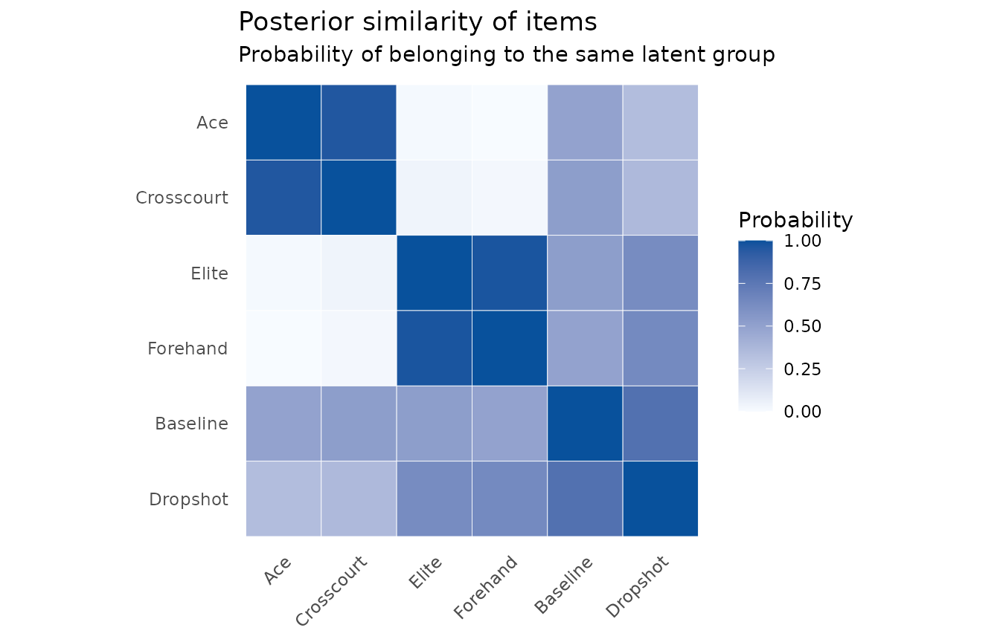
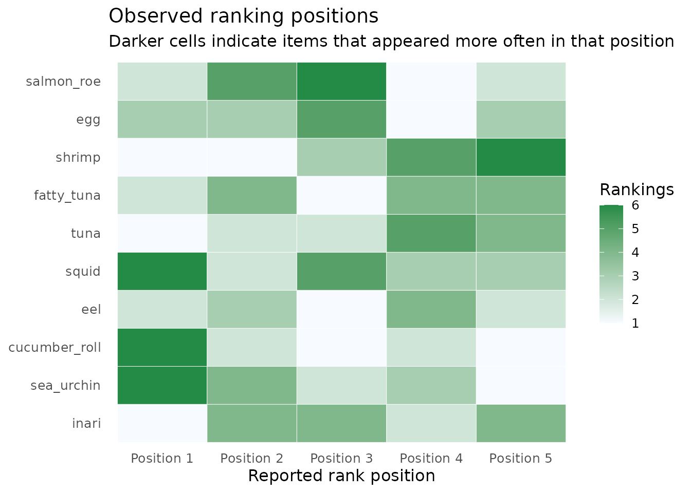
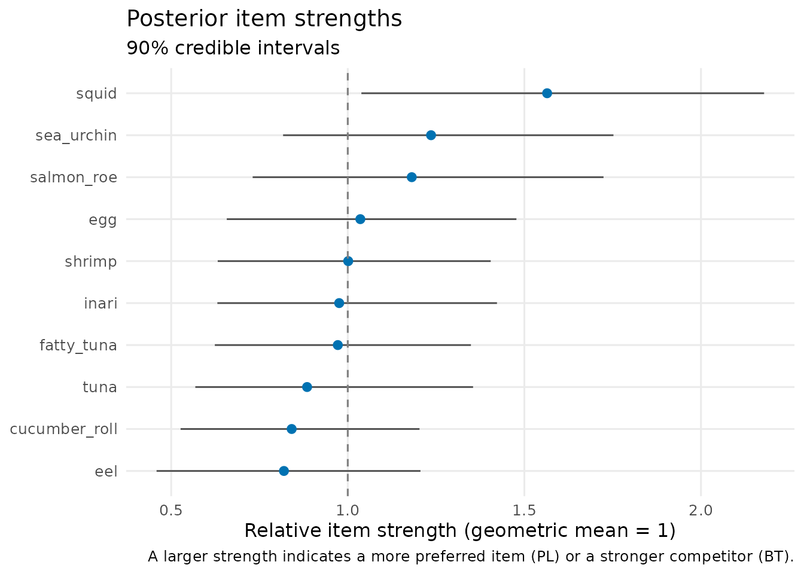
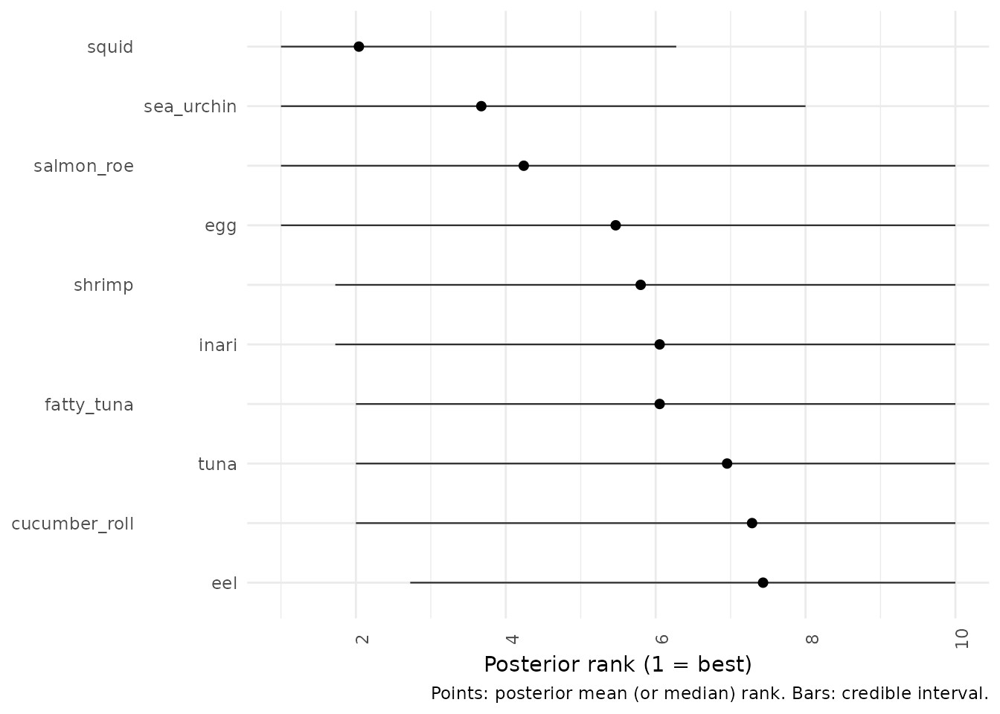
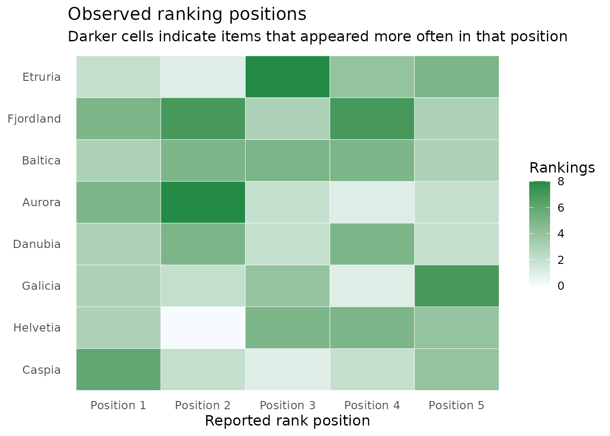
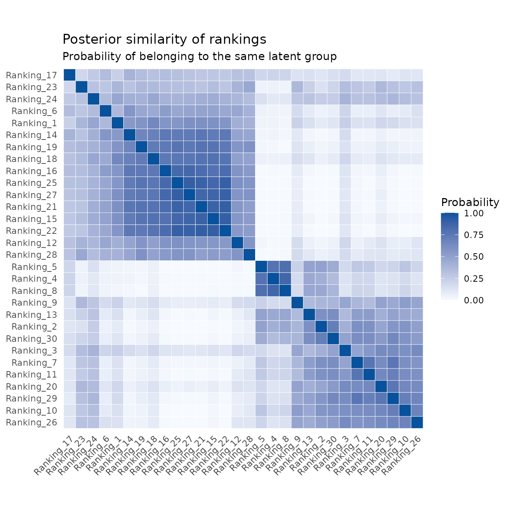
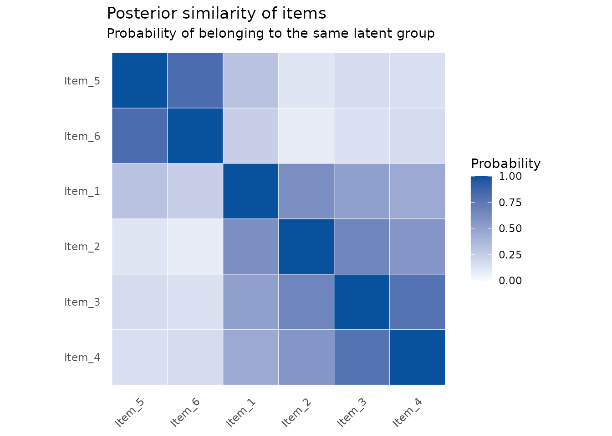
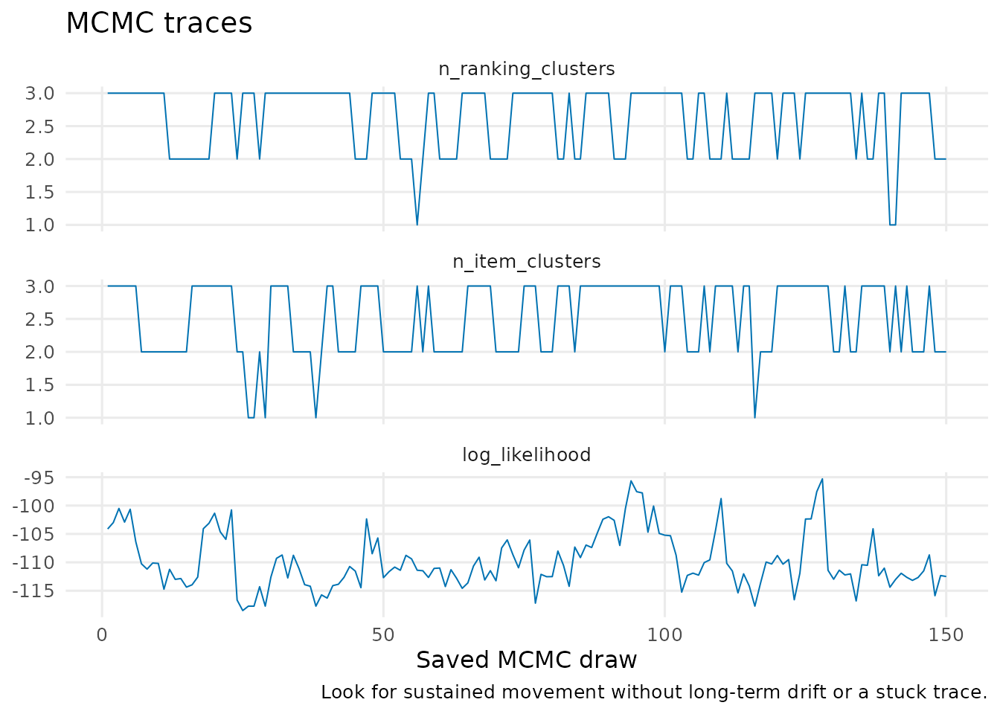

# Toy datasets: choose a model and read its output

This gallery is a map of the package. Each dataset is synthetic, small
enough to run quickly, and designed around one practical question. They
are for learning and testing; they are not real contest, survey, or
match data.

``` r

library(BTSBM)
```

## If you have win/loss counts: tennis

Use a Bradley–Terry model when every observation is a head-to-head
outcome. The first question is simply: which player beat which opponent
most often?

``` r

tennis <- tennis_toy(matches_per_pair = 8, seed = 1)
plot_pairwise_outcomes(tennis)
```


Fit a BT–SBM if players may belong to broad tiers.

``` r

tennis_fit <- fit_btsbm(
  tennis,
  bt_sbm_model(
    item_clustering = finite_partition(max_clusters = 3)
  ),
  mcmc_control(iter = 300, warmup = 150, seed = 2)
)
```

``` r

plot_strength_summary(tennis_fit)
```



``` r

plot_posterior_similarity(tennis_fit, target = "item")
```



Read the first plot as relative player strength and uncertainty. Read
the second as evidence that pairs of players belong to the same tier.

## If you have rankings: Sushi-inspired preferences

Use a PL model when each row is an ordered list. First inspect which
items occur near the top of the reported rankings.

``` r

sushi <- sushi_toy(n_rankings = 30, rank_length = 5, seed = 3)
plot_ranking_positions(sushi)
```



Then estimate item strengths and their uncertainty.

``` r

sushi_fit <- fit_btsbm(
  sushi,
  pl_model(),
  mcmc_control(iter = 300, warmup = 150, seed = 4)
)
```

``` r

plot_strength_summary(sushi_fit)
```



``` r

plot_rank_intervals(sushi_fit)
```



The rank plot is particularly useful when strengths are close: it shows
how much the possible ordering changes across posterior draws.

## If respondents may have different tastes: Eurovision-inspired rankings

Here the items are fictional acts, and the ranking rows are simulated
from two different voting profiles. Use a PL mixture when the question
is about groups of ranking rows rather than groups of items.

``` r

votes <- eurovision_toy(n_rankings = 30, rank_length = 5, seed = 5)
plot_ranking_positions(votes)
```



``` r

mixture_fit <- fit_btsbm(
  votes,
  pl_mixture_model(
    ranking_clustering = dirichlet_process_prior(concentration = 1)
  ),
  mcmc_control(iter = 300, warmup = 150, seed = 6)
)
```

``` r

plot_posterior_similarity(mixture_fit, target = "ranking")
```



Rows and columns are individual rankings. Darker blocks are evidence of
rankings that repeatedly occur in the same latent preference profile.

## If both rows and items may have structure: PL–LBM

The PL latent block model simultaneously groups ranking rows and items.
This is the most structured option in the package. The synthetic fixture
below has known generating groups, so it is a safe place to learn the
workflow.

``` r

structured_rankings <- pl_lbm_toy(n_rankings = 20, rank_length = 4, seed = 7)
lbm_fit <- fit_btsbm(
  structured_rankings,
  pl_lbm_model(
    ranking_clustering = finite_partition(max_clusters = 3),
    item_clustering = finite_partition(max_clusters = 3)
  ),
  mcmc_control(iter = 300, warmup = 150, seed = 8)
)
```

``` r

plot_posterior_similarity(lbm_fit, target = "item")
```



``` r

plot_mcmc_traces(lbm_fit)
```



``` r

mcmc_diagnostics(lbm_fit)
#>             quantity        mean        sd      ess       mcse
#> 1 n_ranking_clusters    2.633333 0.5234971 71.71198 0.06181849
#> 2    n_item_clusters    2.506667 0.5645770 61.70506 0.07187251
#> 3     log_likelihood -109.790990 4.9787178 34.79938 0.84397920
#>   autocorrelation_lag_1
#> 1             0.4454028
#> 2             0.4391249
#> 3             0.6594261
```

For every model, the final step is the same: inspect diagnostics, rerun
with longer and multiple chains for real data, and avoid treating a dark
similarity cell or a narrow interval as a guarantee.
