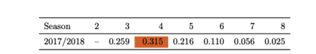
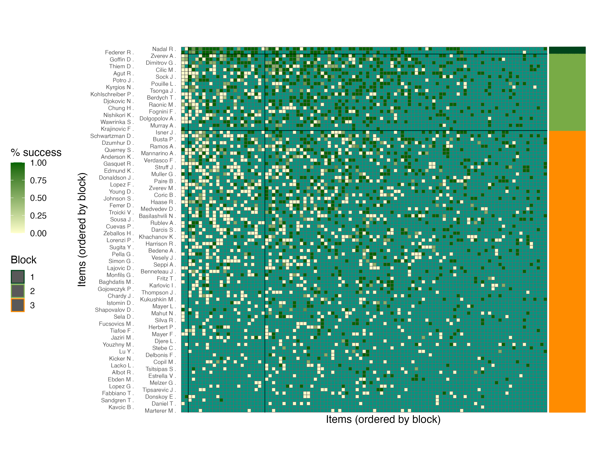

## Overview

**BTSBM** implements Bayesian inference for the *Bradley–Terry Stochastic Block Model* (BT–SBM),  
combining **pairwise comparison data** with **latent block clustering** of items.

The package provides:

1. ⚙️ Gibbs-type MCMC samplers for posterior inference

2. 🎯 Posterior relabeling, point estimates and uncertainty quantification

3. 🌐 Visualization tools for clusters and block interactions

Applications include, among the others, **sports analytics**, **psychometrics**, and **ranking problems** with hidden group structure.

---

### Quick Links

For a complete overview of all functions, see the 👉 [Function Reference](https://laposanti.github.io/BTSBM/reference/index.html)  
For a step-by-step example using tennis data, visit the 👉 [Getting Started Vignette](https://laposanti.github.io/BTSBM/articles/getting-started.html)

---

## When to Use BTSBM

Use this model whenever outcomes can be summarized as *pairwise preferences* (`i` beats `j`). 
Below are a few illustrative examples:

| Domain | Example |
|:--|:--|
| ⚽ Sports & games | Player `i` beats player `j` |
| 🔍 Information retrieval | Document `i` preferred to `j` |
| 🧠 Psychometrics | Stimulus `i` chosen over `j` |
| 🧪 A/B testing | Variant `i` performs better than `j` |

Only a binary outcome per pair (“i over j”) is required, which can optionally be aggregated into counts (positive integers).

For the sake of exposition, we will use a sports-related terminology throughout, though the same framework naturally extends to all the settings listed above — and beyond.
---

## Required Inputs

To fit the model, you need one object:

### `w`: pairwise interaction matrix

*It is as a directed weighted/binary adjacency matrix.*

- Square matrix (`n × n`), where `w[i, j]` = number of times player *i* beats *j*  
- Diagonal must be 0 (`w[i, i] = 0`)  
- For each unordered pair `{i,j}`:  
\( n_{ij} = w_{ij} + w_{ji} \)


---


### Examples

<div style="display: flex; gap: 1.5em;">

<div style="flex: 1;">

**(A) Aggregated counts**

```r
# items: A, B, C, D
# w[i, j] = number of times i beat j
w <- matrix(
c( 0, 3, 0, 2,
1, 0, 4, 0,
2, 0, 0, 1,
0, 1, 3, 0 ),
nrow = 4, byrow = TRUE,
dimnames = list(c("A","B","C","D"), c("A","B","C","D"))
)
````

</div>

<div style="flex: 1;">

**(B) Binary outcomes**

```r
# one comparison per pair observed (0/1 wins)
# w[i, j] is binary
w_bin <- matrix(
c( 0, 1, 0, 1,
0, 0, 1, 0,
1, 0, 0, 0,
0, 1, 1, 0 ),
nrow = 4, byrow = TRUE,
dimnames = list(c("A","B","C","D"), c("A","B","C","D"))
)
```

</div>
</div>

⚠️ The matrix must **not** be symmetric!

---

## Installation

Install the development version from GitHub:

```r
# install.packages("devtools")
devtools::install_github("laposanti/BTSBM")
library(BTSBM)
```

---

## Minimal Example

Let’s fit the BT–SBM with a Gnedin prior on 2017 ATP season data:

```r
# choosing the 2017 season
w_ij <- ATP_2000_2022$`2017`$Y_ij

# fit the model
fit <- gibbs_bt_sbm(
w_ij,
a = 4,
prior = "GN",
n_iter = 500,
burnin = 250,
verbose = FALSE
)

# relabel output
post <- BTSBM::relabel_by_lambda(fit$x_samples, fit$lambda_samples)

# plot adjacency matrix
plot_block_adjacency(fit = post, w_ij = w_ij)
```

The following probabilities of K are supported:



We can use a single point estimate to order the pairwise interaction heatmap as follows:




---

## Workflow at a Glance

1. **Prepare input matrix** `w`

2. **Inspect prior** using [`gnedin_K_mean()`](https://laposanti.github.io/BTSBM/reference/gnedin_K_mean.html) and [`gnedin_K_var()`](https://laposanti.github.io/BTSBM/reference/gnedin_K_var.html)

3. **Fit the model** via [`gibbs_bt_sbm()`](https://laposanti.github.io/BTSBM/reference/gibbs_bt_sbm.html)

4. **Relabel samples** with [`relabel_by_lambda()`](https://laposanti.github.io/BTSBM/reference/relabel_by_lambda.html)

5.️ **Visualize clusters** using [`plot_block_adjacency()`](https://laposanti.github.io/BTSBM/reference/plot_block_adjacency.html)

---

## Learn More

👉 [Function Reference](https://laposanti.github.io/BTSBM/reference/index.html)

👉 [Getting Started Vignette](https://laposanti.github.io/BTSBM/articles/getting-started.html)

---

## Citation

Santi, L., & Friel, N. (2025). *The Bradley–Terry Stochastic Block Model.*
Working paper, University College Dublin.

---


